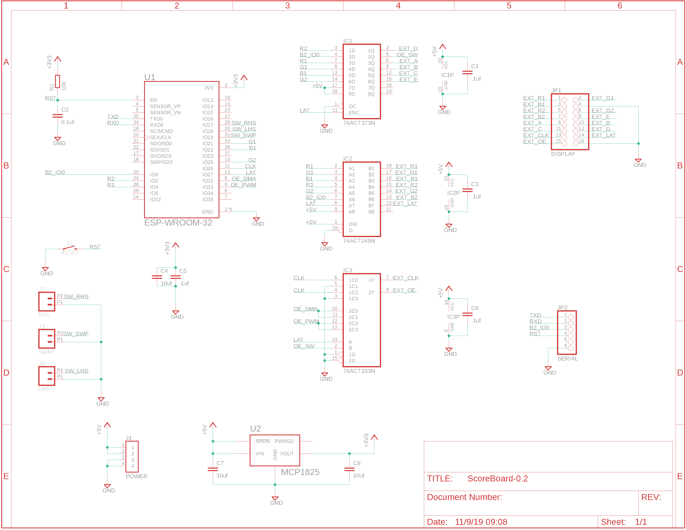

# Badminton Scoreboard

A simple LED Matrix scoreboard for badminton implemented for fun because some friends host a Badminton party in most years.

[src](src) Contains the code for the Badminton Scoreboard
[ScoreBoard](ScoreBoard) contains the schematic and board designs in Eagle cad.

[3d](3d) contains the STL files for the enclosure.

