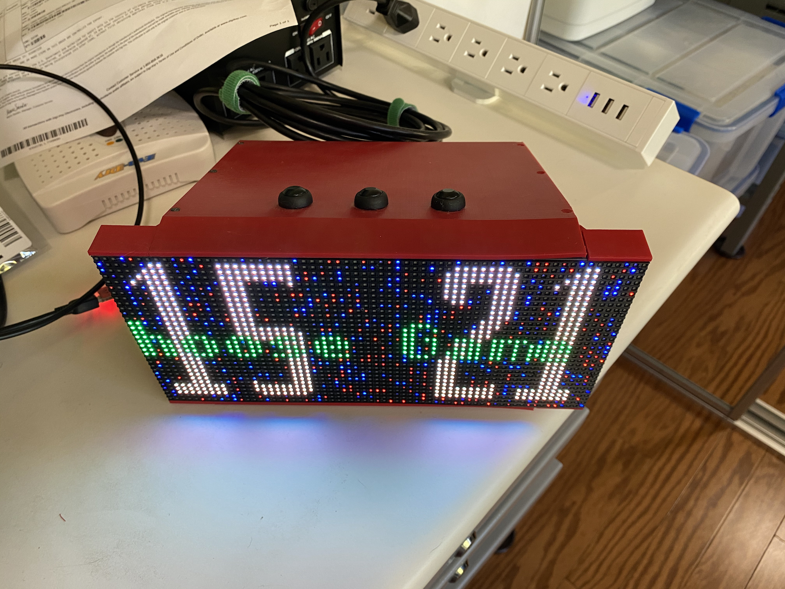
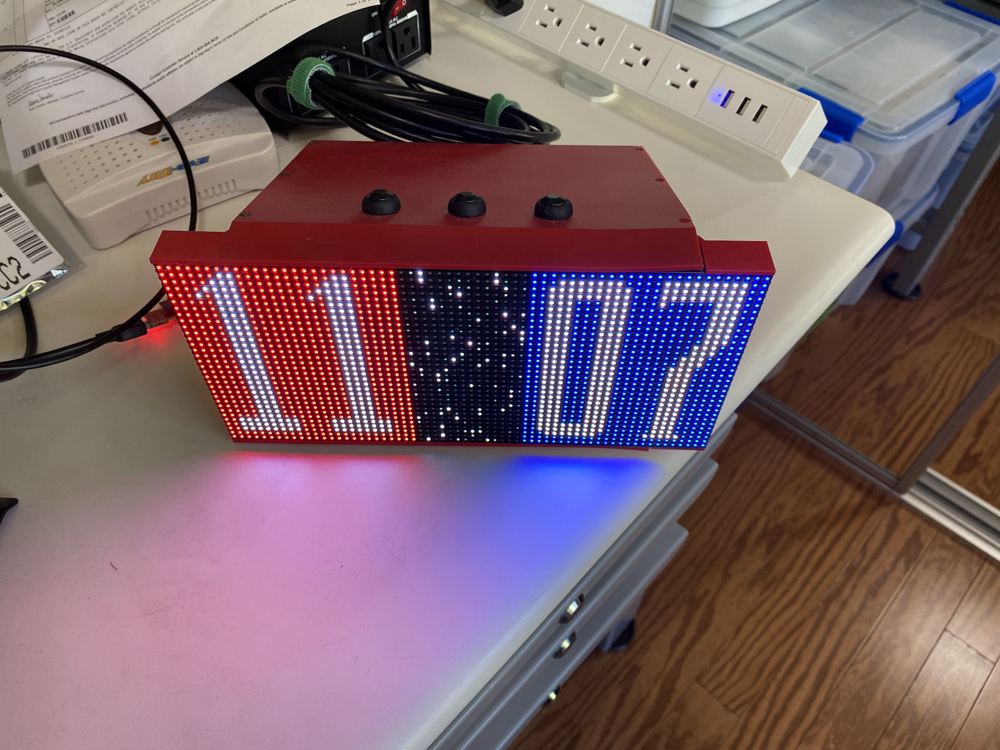

# Badminton Scoreboard

A simple LED Matrix scoreboard for badminton implemented for fun because some friends host a Badminton party in most years.

## Usage

On power on you hve to choose the game score limit between a normal 21 point game and a short 15 point game.  Use the botton on the same side as the game limit you want.  After that a short press on either side button increments the score on that side, a long press decrerments the score in case of a mistake.  A short press on the middle button swaps the score from side to side, a long press will reset the score back to 0 and a very long 10-15 seconds will perform a reset allowing you to change the game limit.

[src](src) Contains the code for the Badminton Scoreboard

[ScoreBoard](ScoreBoard) contains the schematic and board designs in Eagle cad.

[3d](3d) contains the STL files for the enclosure.

## Misc Parts

P4 64x32 LED Display w/HUB75 interface

[50 Watt 5v power supply](https://smile.amazon.com/gp/product/B019GYOCMM/ref=ppx_yo_dt_b_search_asin_title?ie=UTF8&psc=1)

3 SPST Buttons
